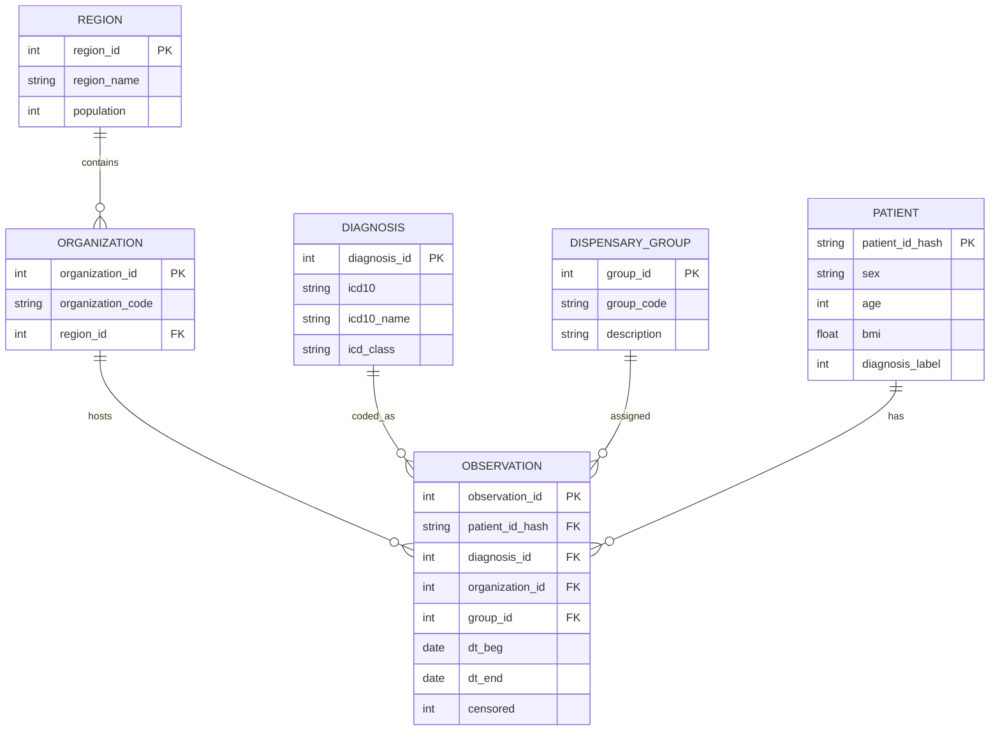

# ER diagram (logical)

```mermaid
erDiagram
    REGION ||--o{ ORGANIZATION : contains
    ORGANIZATION ||--o{ OBSERVATION : hosts
    DIAGNOSIS ||--o{ OBSERVATION : coded_as
    DISPENSARY_GROUP ||--o{ OBSERVATION : assigned
    PATIENT ||--o{ OBSERVATION : has

    REGION {
        int region_id PK
        string region_name
        int population
    }
    ORGANIZATION {
        int organization_id PK
        string organization_code
        int region_id FK
    }
    DIAGNOSIS {
        int diagnosis_id PK
        string icd10
        string icd10_name
        string icd_class
    }
    DISPENSARY_GROUP {
        int group_id PK
        string group_code
        string description
    }
    PATIENT {
        string patient_id_hash PK
        string sex
        int age
        float bmi
        int diagnosis_label
    }
    OBSERVATION {
        int observation_id PK
        string patient_id_hash FK
        int diagnosis_id FK
        int organization_id FK
        int group_id FK
        date dt_beg
        date dt_end
        int censored
    }
```
